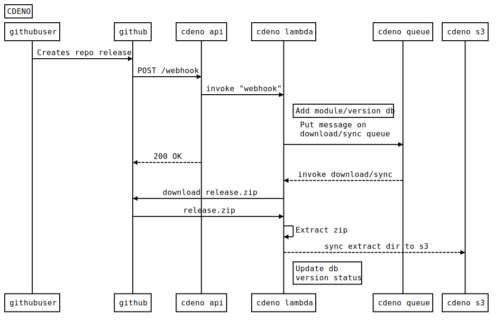

## Install serverless
You need to have [serverless](https://serverless.com/) installed and your [AWS Credentials](https://serverless.com/framework/docs/providers/aws/guide/credentials#creating-aws-access-keys) in place.

## Deploy stack

The stack consists of 1 sqs queue, 1 dynamodb, 7 lambdas, 1 s3 bucket & an API Gateway with 6 routes

`serverless deploy`

or with options (default values shown)

`serverless deploy --stage dev --bucket cdeno --region eu-west-2`

AWS Bucket names are unique so choose something that's unlikely to clash.

The stage is suffixed to the bucket name i.e. `cdeno-dev`

## Test stack

If the deployment worked serverless should report the API gateway endpoints.
To test the stack works, try POSTing to the `/register` endpoint using the following body:

```json
{
  "url": "https://github.com/denoland/deno_std/releases/tag/v0.8.0",
  "description": "deno standard modules"
}
```

Wait a few seconds and then check your resources.
The s3 bucket should have a copy of the source code and the dynamo tables a registry entry for the module.

